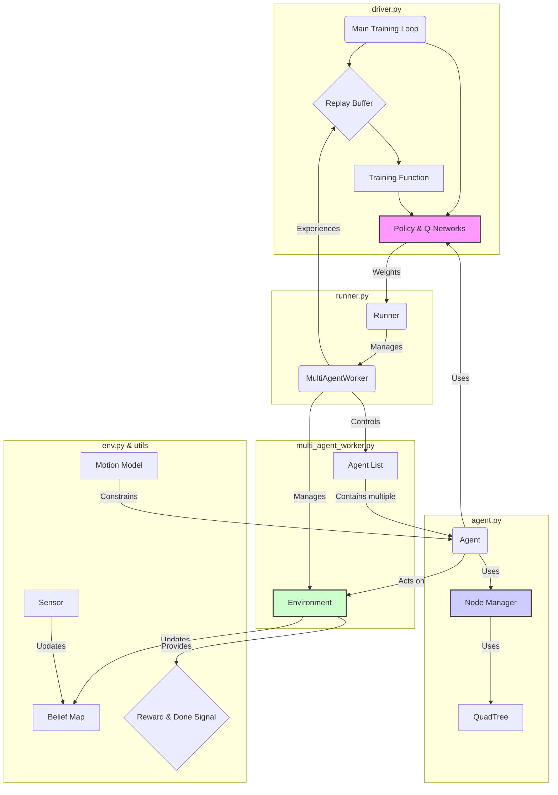

# Gemini Analysis Summary for MARVEL Project

This document summarizes the key architectural insights and workflow of the MARVEL project, as determined through collaborative analysis. It serves as a quick context refresher for future sessions.

## 1. Core Architecture: CTDE

The project is built on a **Centralized Training, Decentralized Execution (CTDE)** paradigm.

-   **Centralized Training**: A single, master process (`driver.py`) aggregates experiences from all agents and updates one central set of neural networks. This allows for stable and efficient learning.
-   **Decentralized Execution**: During simulation, each agent acts autonomously based on its own local observations. It uses a copy of the centrally-trained policy but does not require information about other agents to make a decision.

## 2. Key Concepts & Mechanisms

### Parameter Sharing
All agents in a simulation share the exact same neural network instances (`PolicyNet`, `QNet`).

-   **Evidence**: `driver.py` initializes only one set of networks. These network weights are then distributed to all `runner.py` instances, which in turn pass the same network reference to every `Agent` they manage.
-   **Benefit**: This approach is highly scalable and promotes generalization, as the experience of every agent contributes to the learning of a single, robust policy.

### Intelligent Action Space Sampling
A critical feature of this project is how it handles the potentially massive action space (Waypoint × Heading).

-   **Problem**: A naive action space would be too large to learn efficiently.
-   **Solution**: The `agent.py:compute_best_heading` function intelligently prunes the action space. For each potential waypoint (neighboring node), it samples a small number (`num_heading_candidates`) of the most promising headings.
    -   If the node has observable frontiers, it samples headings that maximize frontier visibility.
    -   If not, it samples headings that align with the A* path toward the next high-utility goal.
-   **Result**: The `PolicyNet` only needs to choose from a drastically reduced, high-quality set of candidate actions (`num_neighbors * num_heading_candidates`).

## 3. Module Breakdown & Workflow

The overall workflow follows the CTDE model, orchestrated by the `driver`.

### Workflow Diagram

### Execution & Training Flow

1.  **Distribution (`driver.py`)**: The `driver` distributes the current network weights to all `Runner` actors.
2.  **Execution (`runner.py` -> `multi_agent_worker.py` -> `agent.py`)**: Each `Runner` executes a simulation episode. Inside, each `Agent` uses the shared policy to decide its action based on its local graph-based observation from its `NodeManager`.
3.  **Collection (`runner.py` -> `driver.py`)**: The `Runner` collects the `(s, a, r, s')` trajectories from all its agents and sends them back to the `driver`.
4.  **Aggregation (`driver.py`)**: The `driver` stores these experiences in the central `ReplayBuffer`.
5.  **Training (`driver.py`)**: The `driver` samples a mini-batch from the `ReplayBuffer` and updates the central networks. The cycle then repeats.
