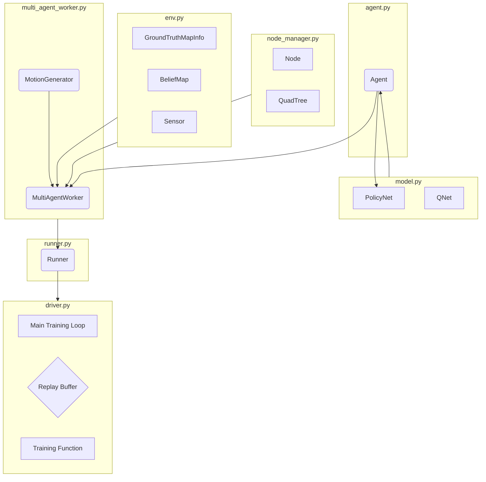

# MARVEL: Multi-Agent Reinforcement Learning for constrained field-of-View multi-robot Exploration in Large-scale environments

This repository hosts the code for [**MARVEL**](https://arxiv.org/abs/2502.20217), accepted for [ICRA 2025](https://2025.ieee-icra.org/).

<div>
   
   
</div>

**Supplementary video link:** [YouTube](https://youtu.be/uwQqkruBvwY)

MARVEL is a neural framework that leverages graph attention networks, together with novel frontiers and orientation features fusion technique, to develop a collaborative, decentralized policy using multi-agent reinforcement learning (MARL) for robots with constrained FoV. 

## Setup instructions

Use conda to setup your environment:

```bash
conda env create -f marvel.yml
conda activate marvel
```

## Evaluation

First, set the appropriate parameters in `test_parameter.py` and adjust testing configurations within `test_driver.py`. Run `test_driver.py` to evaluate.

## Training

Set appropriate parameters in `parameter.py` and run `driver.py` to train the model.


## Citation

If you find our work useful, please consider citing our paper:

```bibtex
@article{chiun2025marvel,
  title={MARVEL: Multi-Agent Reinforcement Learning for constrained field-of-View multi-robot Exploration in Large-scale environments},
  author={Chiun, Jimmy and Zhang, Shizhe and Wang, Yizhuo and Cao, Yuhong and Sartoretti, Guillaume},
  journal={arXiv preprint arXiv:2502.20217},
  year={2025}
}

```

Authors:
[Jimmy Chiun](https://www.linkedin.com/in/jimmychiun/),
Shizhe Zhang,
[Yizhuo Wang](https://www.yizhuo-wang.com/),
[Yuhong Cao](https://www.yuhongcao.online/),
[Guillaume Sartoretti](https://cde.nus.edu.sg/me/staff/sartoretti-guillaume-a/)

---

## Architecture and Workflow

This section provides a deeper insight into the project's architecture and the workflow of the MARL training process, based on a detailed code analysis.

### Module Block Diagram

The project is composed of several key modules that interact to create the multi-agent exploration and learning environment. The relationships can be visualized as follows:



### Core Module Functions

*   **`driver.py` (The Conductor):**
    *   Orchestrates the entire training process.
    *   Initializes the master Policy/Q-Networks, optimizers, and the global Replay Buffer.
    *   Distributes the latest network weights to distributed `Runner` instances.
    *   Collects experience data from all runners and stores it in the Replay Buffer.
    *   Samples mini-batches from the buffer to train the master networks.
    *   Logs all performance metrics to TensorBoard.

*   **`utils/runner.py` (The Unit Leader):**
    *   Acts as a distributed worker using `Ray`.
    *   Receives the latest network weights from the `driver`.
    *   Manages a `MultiAgentWorker` to run a single, complete simulation episode.
    *   Returns the collected episode data (trajectories) and performance metrics to the `driver`.

*   **`utils/multi_agent_worker.py` (The Episode Manager):**
    *   Manages the entire lifecycle of one simulation episode.
    *   Creates the `Env` and a list of `Agent` instances.
    *   In a loop, it prompts each `Agent` to decide on an action, executes that action in the `Env`, and calculates rewards.

*   **`utils/agent.py` (The Autonomous Agent):**
    *   Represents a single robot. It holds its own state (location, heading).
    *   **Perception:** Uses its `NodeManager` to perceive the world as a graph.
    *   **Decision:** Queries the shared `PolicyNet` with its local observation to select its next waypoint and heading. This is a key aspect of **Decentralized Execution**.
    *   **Memory:** Records its state, action, and received reward into its local `episode_buffer`.

*   **`utils/node_manager.py` (The Agent's World Modeler):**
    *   A crucial component that translates the raw map data from the `Env` into a structured graph representation (nodes and edges) that the `Agent` can use for planning.
    *   Calculates the `utility` of each node based on observable frontiers.
    *   Uses a `QuadTree` for efficient spatial queries of nodes.

*   **`utils/env.py` (The World/Physics Engine):**
    *   Maintains the state of the simulation world, including the `ground_truth` map and the agents' shared `robot_belief` map.
    *   Updates the `robot_belief` map based on agents' actions, using the `sensor.py` model.
    *   Calculates the team reward based on the newly explored area.
    *   Determines if the episode is complete.

*   **`utils/model.py` (The Shared Brain):**
    *   Defines the architecture of the `PolicyNet` (Actor) and `QNet` (Critic).
    *   All agents share a single instance of these networks for decision-making, a strategy known as **Parameter Sharing**.
    *   The networks are designed to take a single agent's local observation as input and produce a decision for that agent only.

### Training Workflow (Centralized Training, Decentralized Execution)

The project follows the CTDE paradigm, which can be broken down into these steps:

1.  **Distribution (in `driver.py`):** The `driver` takes the latest weights from the central `PolicyNet` and distributes them to all `Runner` instances via Ray's object store.

2.  **Decentralized Execution (in `multi_agent_worker.py` & `agent.py`):**
    *   Each `Runner` starts an episode. Inside the episode, each `Agent` acts independently.
    *   An `Agent` creates a local observation of its surroundings using its `NodeManager`.
    *   It inputs this local observation into its copy of the shared `PolicyNet` to get its own action. It does **not** need to know the state of other agents to act.
    - This process is repeated for all agents in a loop.

3.  **Data Collection (in `runner.py`):** The `MultiAgentWorker` collects the `(state, action, reward, next_state)` trajectories from all agents throughout the episode and sends the complete data back to the `driver`.

4.  **Centralized Training (in `driver.py`):**
    *   The `driver` gathers the experience data from all `Runners` into a central `ReplayBuffer`.
    *   The `train` function samples a mini-batch from this buffer. This batch contains the mixed experiences of all agents from various episodes.
    *   The central `PolicyNet` and `QNet` are updated using this rich, diverse dataset. The Critic (`QNet`) may use information about all agents during training to make the learning process more stable and efficient.

5.  **Repeat:** The newly updated weights are then re-distributed for the next cycle of execution and learning.
